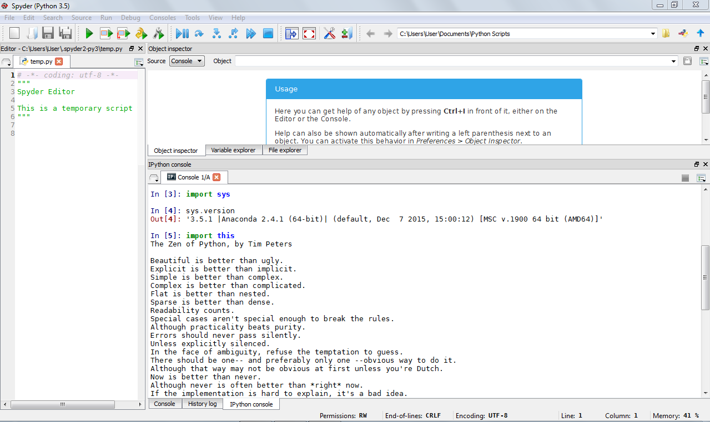

UECM3033 Assignment #1 Report
========================================================

- Prepared by: ** Lee Kah Woh **
- Tutorial Group: T2

--------------------------------------------------------

## Task 1 -- setup a github repository

The reports, codes and supporting documents are uploaded to Github at: 

https://github.com/LeeKahWoh/UECM3033_assign1

---------------------------------------------------------

## Task 2 -- setup python

Put here the screen shot of file (python.png)

------------------------------------------------------------

## Task 3 -- modify and run Python script

In this section, please report:

1. The hexadecimal value of your student ID.

Hexadecimal representation of 1404656 is 0x156ef0

2. Write down the definite integrals that you have chosen.

$$\int_0^{\infty} \frac{8}{9}*e^{4*\sin(x^4)+5} dx = 0.888888888888889*e^5*\int_0^{\infty} (e^4*\sin(x^4)).$$

3. Write down your system of 10 linear equations.

\begin{align*}
1 x_0 + 2 x_1 + 2 x_2 + 8 x_3 + 6 x_4 + 8 x_5 + 1 x_6 + 2 x_7 + 4 x_8 + 7 x_9 &= 3,\\
5 x_0 + 2 x_1 + 0 x_2 + 0 x_3 + 0 x_4 + 0 x_5 + 2 x_6 + 5 x_7 + 5 x_8 + 5 x_9 &= 1,\\
2 x_0 + 5 x_1 + 6 x_2 + 7 x_3 + 8 x_4 + 4 x_5 + 5 x_6 + 6 x_7 + 3 x_8 + 4 x_9 &= 1,\\
2 x_0 + 3 x_1 + 5 x_2 + 7 x_3 + 9 x_4 + 5 x_5 + 3 x_6 + 3 x_7 + 6 x_8 + 7 x_9 &= 7,\\
4 x_0 + 6 x_1 + 7 x_2 + 8 x_3 + 2 x_4 + 4 x_5 + 5 x_6 + 6 x_7 + 5 x_8 + 3 x_9 &= 8,\\
4 x_0 + 6 x_1 + 7 x_2 + 8 x_3 + 4 x_4 + 3 x_5 + 2 x_6 + 5 x_7 + 6 x_8 + 8 x_9 &= 2,\\
5 x_0 + 6 x_1 + 7 x_2 + 8 x_3 + 9 x_4 + 4 x_5 + 3 x_6 + 2 x_7 + 5 x_8 + 6 x_9 &= 5,\\
2 x_0 + 4 x_1 + 5 x_2 + 6 x_3 + 7 x_4 + 7 x_5 + 8 x_6 + 8 x_7 + 4 x_8 + 9 x_9 &= 7,\\
0 x_0 + 0 x_1 + 0 x_2 + 0 x_3 + 2 x_4 + 3 x_5 + 5 x_6 + 5 x_7 + 6 x_8 + 7 x_9 &= 2,\\
9 x_0 + 9 x_1 + 8 x_2 + 8 x_3 + 6 x_4 + 6 x_5 + 4 x_6 + 4 x_7 + 0 x_8 + 0 x_9 &= 7.
\end{align*}

-----------------------------------

last modified: 29 January 2016 
